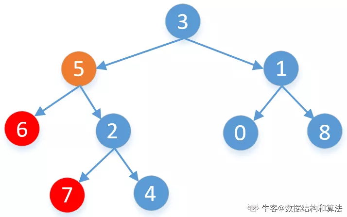
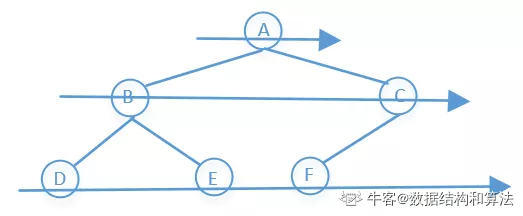

# NEWCODER 刷题集合(涵盖101)

&emsp;&emsp;本文档主要是针对newcoder101题刷题的总结和方法归纳，用于面试前翻看和回忆复习。其文档归纳逻辑为依据题型进行归纳

## 01 链表

### BM1 反转链表

* 链表的反转主要依赖于prev prt && cur ptr && next ptr;
* 核心逻辑为:
&emsp;&emsp;next = cur->next;
&emsp;&emsp;cur->next = prev;
&emsp;&emsp;prev = cur, cur = next;
* 注意按照上述方案，最后的返回为prev;

### BM2 链表内指定区间反转

&emsp;&emsp;实现区间(m,n)内反转，最重要的一点是锁定区间，即先找到对应的区间起点m。为避免反转区间从head头开始，本方案首先创建哑结点，使其头插head。其次找区间过程使用prev定位翻转区间的前一个结点用于反转区间的衔接。
一下给定具体的反转逻辑
```c++
    for(int i = m; i < n; i++){
        ListNode* temp = cur->next;
        cur->next = temp->next;
        temp->next = prev->next;
        prev->next = temp;
    }
```

### BM3 链表中的节点每k个一组翻转

* 核心思想每次滑动窗口滑k个步长,将其记录为tail
* while(cur != tail) 的长度内使用链表反转
* 递归调用head->next = reverseKGroup(tail, k);
* return prev (此为定义在反转链表中的prev)

### BM4 合并两个排序的链表

&emsp;&emsp; 没啥好说的，递归可以搞定，题目比较简单，递归思想也比较好理解

### BM5 合并k个已排序的链表

&emsp;&emsp;基础思想是使用二分法对于区间进行划分，后调用合并两个有序链表方法，进行两两合并，主要的点是对于merge()函数编写是本题一个技术点。4399暑期实习有一个类似的笔试题，其主要是对于降序列表的排列，还需要再写一个reverseFun()。

本文档主要给出merge函数的编写，并注释需要处理的细节部分。

```c++
    ListNode *merge(vector<ListNode*>&list, int left,int right){
        if(left == right){
            return &list[left]; // 注意此条件；
        }
        else if(left > right){ return nullprt;}
        int mid = left+right >>1;
        return mergeTwoList(merge(list,left,mid), merge(list,mid+1,right));
    }
```

### BM6 判断链表中是否有环

* 双指针 相等就行,注意掌握该思想，用于其他题目

```c++
/**
 * Definition for singly-linked list.
 * struct ListNode {
 *     int val;
 *     ListNode *next;
 *     ListNode(int x) : val(x), next(NULL) {}
 * };
 */
class Solution {
public:
    bool hasCycle(ListNode *head) {
        if(!head) return false;
        
        ListNode* fast = head;
        ListNode* slow = head;
        while(fast && fast->next){
            fast = fast->next->next;
            slow = slow->next;
            if(fast == slow){
                return true;
            }
        }
        return false;
    }
};
```

### BM7 链表中环的入口结点
&emsp;&emsp;快慢指针一起走，每次快走两步，慢走一步，当两者相遇，必定在环中，此时令快指针等于头结点，再变成两者同步每次走一步，如果相遇则必定是在入口相遇。

``` c++
    // 只给出最核心代码
    if(fast == slow){
        fast = head;
        while(fast != slow){
            fast = fast->next;
            slow = slow->next;
        }
        return
    }
```

### BM8 链表中倒数最后k个结点

&emsp;&emsp;(双指针) 先快指针走k步，然后慢指针与快指针一起走到底，fast == nullprt时候返回的slow就是倒数第k个值。

### BM9 删除链表的倒数第n个节点

* 为了防止删除的是头结点，先创建一个哑结点用于返回使用
* 首先使用一个预先结点走n步,用于后续辅助删除的双指针的定位，此思想类似于返回链表的倒数第K个节点
* 使用prev指向哑结点，cur指向头向后滑动，滑动到预先结点为空时候，prev->next = cur->next，完事儿。

### BM10 两个链表的第一个公共结点

&emsp;&emsp;找触底，后换到另一条链表的链表头部，其核心思想为交换赋值，消除链表相差段部分

``` c++
    ListNode* FindfirstCommonNode(ListNode* pHead1, ListNode* pHead2){
        if(!pHead1 || !pHead2) return nullptr;

        ListNode *l1 = pHead1, *l2 = pHead2;
        while(l1 != l2){
            l1 = l1 == nullptr? pHead2:l1->next;
            l2 = l2 == nullptr? pHead1:l2->next;
        }
        return l1;
    }
```

### BM11 链表相加(二)

&emsp;&emsp;反转，使用新链表复制原链表相加结果,注意进位等操作即可。(也需要一个哑结点辅助返回)

### BM12 单链表的排序

* 采用二分法和合并两个有序链表共同完成本题
* 其要点包括找到链表的中点(使用left指针将链表一分为二)，对两个链表进行合并
* 主要是需要理解为什么合并两个有序链表的方案可以运用到本题目，理解其与二分法合用的妙处所在。(将原来的链表拆分成单个结点后merge的过程,注意理解其与合并K个有序链表思想的异同点)

以下给出完整代码，辅助理解.

``` c++
/**
 * struct ListNode {
 *	int val;
 *	struct ListNode *next;
 * };
 */

class Solution {
public:
    /**
     * 
     * @param head ListNode类 the head node
     * @return ListNode类
     */
    ListNode* sortInList(ListNode* head) {
        // write code here
        if(!head || !head->next) return head;
        
        ListNode* left = head;
        ListNode* mid = head->next;
        ListNode* right = head->next->next;
        
        while(right&& right->next){
            left = left->next;
            mid = mid->next;
            right = right->next->next;
        }
        
        left->next = nullptr; 
        
        return mergeListNode(sortInList(head), sortInList(mid));
    }
    
private:
    ListNode *mergeListNode(ListNode* l1, ListNode* l2){
        if(!l1) return l2;
        if(!l2) return l1;
        
        if(l1->val <= l2->val){
            l1->next = mergeListNode(l1->next, l2);
            return l1;
        }
        
        if(l1->val > l2->val){
            l2->next = mergeListNode(l1, l2->next);
            return l2;
        }
        
        return nullptr;
    }
};
```

### BM13 判断一个链表是否为回文结构

&emsp;&emsp;本题目比较好完成，其基本方案主要分为如下几步

* 找到中点，借用上题一样的方案找，将链表一分为二
* 将后半部分反转
* 两个链表向后滑动判断是否相等，不等返回false即可

### 链表的奇偶重排

&emsp;&emsp;思想较为简单，不做过多的赘述，给出代码便于理解即可

``` c++
/**
 * struct ListNode {
 *	int val;
 *	struct ListNode *next;
 *	ListNode(int x) : val(x), next(nullptr) {}
 * };
 */
class Solution {
public:
    /**
     * 代码中的类名、方法名、参数名已经指定，请勿修改，直接返回方法规定的值即可
     *
     * 
     * @param head ListNode类 
     * @return ListNode类
     */
    ListNode* oddEvenList(ListNode* head) {
        // write code here
        if(!head){ return nullptr; }
        
        ListNode *oddLink = head;
        ListNode *evenLink = head->next;
        
        ListNode *evenHead = evenLink;
        
        while(evenLink && evenLink->next){
            oddLink->next = evenLink->next;
            oddLink = oddLink->next;
            
            evenLink->next = oddLink->next;
            evenLink = evenLink->next;
        }
        oddLink->next = evenHead;
        
        return head;
    }
};
```

### BM15 删除有序链表中重复的元素-I

&emsp;&emsp;核心思想在于比较cur与cur->next的值，当处于相等状态时候 cur->next = cur->next->next；当不相等时候cur继续往前走，最后返回head就能完成本题目，为常规思路。

### BM16 删除有序链表中重复的元素-II

&emsp;&emsp;本题目要求空间复杂度为O(1)， 时间复杂度为O(n)，即在原数组上进行修改，能考虑的方案即为使用双指针进行处理；由于题目要求和前一题最大的不同在于要将所有重复的点均删除，则需要考虑的点包括当头结点重复被删除的情况，和考虑删除时如何进行重新连接的过程即保留删除串的前一个结点和删除串尾结点的下一个结点的连接问题。针对以上问题的讨论给出如下思路和解决方案。

* 构建哑结点，将cur结点的前驱prev指向哑结点，prev结点构建的目的是记录删除串的前一个结点
* 记录一个标志位，当值大于零时候表明这部分全为重复串
* 当出现重复，即cur->val == cur->next->val时候，一直往下走，即使cur->next = cur->next->next，并每次往下走都将标志位自增
* 判断标志位大于0说明有重复，这时候令prev->next = cur->next可以抛弃该段重复
* 否则正常往前走

结合上述思想可以完成如下代码块

``` c++
/**
 * struct ListNode {
 *	int val;
 *	struct ListNode *next;
 * };
 */

class Solution {
public:
    /**
     * 
     * @param head ListNode类 
     * @return ListNode类
     */
    ListNode* deleteDuplicates(ListNode* head) {
        // write code here
        if(!head) return nullptr;
        
        ListNode *dummyNode = new ListNode(-1);
        dummyNode->next = head;
        
        ListNode *prev = dummyNode;
        ListNode *cur = head;
        int duplicateCount = 0;
        while(cur && cur->next){
            if(cur->val == cur->next->val){
                cur->next = cur->next->next;
                duplicateCount++;
            }
            else{
                if(duplicateCount > 0){
                    prev->next = cur->next;
                    duplicateCount = 0;
                }
                else{
                    prev = cur;
                }
                cur = cur->next;
            }
        }
        if(duplicateCount > 0){
            prev->next = cur->next;
            // duplicateCount = 0;
        }
        
        return dummyNode->next;
    }
};
```

## 02 二分查找/排序

&emsp;&emsp;二分查找最重要的部分在于确定左右边界，为此存在不同的模板，用于不同情况下的使用

```c++
// 模板一
while(left < right){
    if(... == ...){
        ...
    }
    else if((...mid)<(...tar)){
        left = mid+1;
    }else{
        right = mid;
    }
}
```

``` c++
// 模板一
while(left <= right){
    if(... == ...){
        ...
    }
    else if((...mid)<(...tar)){
        left = mid+1;
    }else{
        right = mid-1;
    }
}
```

### BM17 二分查找-I

最基础的二分查找算法, 给出代码模板

``` c++

class Solution {
public:
    /**
     * 代码中的类名、方法名、参数名已经指定，请勿修改，直接返回方法规定的值即可
     *
     * 
     * @param nums int整型vector 
     * @param target int整型 
     * @return int整型
     */
    int search(vector<int>& nums, int target) {
        // write code here
        return BinarySearch(nums, 0, nums.size()-1, target);
    }
    
private:
    int BinarySearch(vector<int>& nums, int left, int right, int target){
        if(left > right) return -1;
        while(left <= right){
            int mid = (right-left)/2 + left;
            if(target == nums[mid]){
                return mid;
            }
            else if(target > nums[mid]){
                return BinarySearch(nums, mid+1, right, target);
            }else{
                return BinarySearch(nums, left, mid-1, target);
            }
        }
        return -1;
    }    
};

```

### BM18 二维数组中的查找

&emsp;&emsp;一个模拟搜索过程，因为向右和向下都是增加，可以考虑左下角向右上角搜索过程,详细解答过程略过

### BM19 寻找峰值

&emsp;&emsp;本题主要使用二分查找的思想进行解决，即每次以中值为标杆，如果中点值小于右边的值，则说明往右走一定存在一个峰值，则左边界往有收缩，反之则右边界往左收缩。

* 二分查找首先从数组首尾开始，每次取中间值，直到首尾相遇。
* 如果中间值的元素大于它右边的元素，说明往右是向下，我们不一定会遇到波峰，但是那就往左收缩区间。
* 如果中间值大于右边的元素，说明此时往右是向上，向上一定能有波峰，那我们往右收缩区间。
* step 4：最后区间收尾相遇的点一定就是波峰。

根据以上描述最后实现的代码为:

``` c++
class Solution {
public:
    /**
     * 代码中的类名、方法名、参数名已经指定，请勿修改，直接返回方法规定的值即可
     *
     * 
     * @param nums int整型vector 
     * @return int整型
     */
    int findPeakElement(vector<int>& nums) {
        // write code here
        int left = 0,right = nums.size()-1;
        while(left < right){
            int mid = (right-left)/2+left;
            if(nums[mid] < nums[mid+1]){
                left = mid+1;
            }
            else{
                right = mid;
            }
        }
        return left;
    }
};
```

###  BM20 数组中的逆序对

&emsp;&emsp;本题主要是归并排序的实现，使用二分进行区间划分，采用归并排序进行归并

``` c++
class Solution {
public:
    int InversePairs(vector<int> data) {
        if(data.size() < 2) return 0;
        vector<int>temp(data.size(),0);
        mergeSort(data, 0, data.size()-1, temp);
        return ans%1000000007;
    }
private:
    long long ans = 0;
    
    void mergeSort(vector<int>& data, int left, int right, vector<int>& temp){
        if(left >right){
            return;
        }
        else if(left<right){
            int mid = (right-left)/2 + left;
            mergeSort(data, left, mid, temp);
            mergeSort(data, mid+1, right, temp);
            merge(data, left, right, mid, temp);
        }
    }
    
    void merge(vector<int> &nums, int left, int right, int mid, vector<int> &temp){
        int i = left, j = mid+1;
        int t = 0;
        
        while(i <= mid && j <= right){
            if(nums[i] > nums[j]){
                ans += (mid+1)-i;
                temp[t++] = nums[j++];
            }
            else{
                temp[t++] = nums[i++];
            }
         }
        
        while(i <= mid){
            temp[t++] = nums[i++];
        }
        while(j <= right){
            temp[t++] = nums[j++];
        }
        t = 0;
        while(left <= right){
            nums[left++] = temp[t++];
        }
    }
};
```

### BM21 旋转数组的最小数字

核心思想是采用二分法不断逼近，由于该旋转数组是原有序数组的旋转，以此旋转数组的最小值为标杆其左边的值显著不大于该值，旋转数组右边的值显著不小于该值，因此可以完全借鉴二分的方案对查找区间不断收缩

* int mid = (right - left) /2 + left;
* 当mid的值大于右边 左边往右边收缩
* 当mid的值小于右边，右边向左收缩
* 当mid值和右边值相等，右边引用自减；
* 循环结束条件为左右夹逼到一个固定值 即为最小值
 
``` c++
class Solution {
public:
    int minNumberInRotateArray(vector<int> rotateArray) {
        int left = 0,right  = rotateArray.size()-1;
        while(left <= right){
            int mid = (right-left)/2 + left;
            if(rotateArray[mid] == rotateArray[right]){
                right--;
            }else if(rotateArray[mid] > rotateArray[right]){
                left = mid + 1;
            }else{
                right = mid;
            }
        }
        return rotateArray[left];
    }
};
```

### BM22 比较版本号

比较版本号核心思想是使用双指针分别指向两个string，并以小数点分块，在各个不同的块之间比较，比较的过程是把每一个块转化为数字，直接比较相同顺序块之间的大小，并以此作为返回的依据，遇到小数点则说明到了块结尾，下次比较下一个块需要跳过该'.'。

``` c++
class Solution {
public:
    /**
     * 代码中的类名、方法名、参数名已经指定，请勿修改，直接返回方法规定的值即可
     *
     * 比较版本号
     * @param version1 string字符串 
     * @param version2 string字符串 
     * @return int整型
     */
    int compare(string version1, string version2) {
        // write code here
        int ptr1= 0,ptr2 = 0;
        int m = version1.length(), n = version2.length();
        while(ptr1 < m || ptr2 < n){
            int num1 = 0, num2 = 0;
            // 分块进行比较
            while(ptr1 < m && version1[ptr1] != '.'){
                num1 = num1*10 + (version1[ptr1++] -'0');
            }
            while(ptr2 < n && version2[ptr2] != '.'){
                num2 = num2*10 + (version2[ptr2++] -'0');
            }
            
            if(num1 > num2){
                return 1;
            }else if(num1  < num2){
                return -1;
            }
            // 跳过每个块之间的 '.'
            ptr1++;
            ptr2++;
        }
        return 0;
    }
};
```

### BM23 二叉树的前序遍历

二叉树的前序遍历遵循中左右的访问顺序进行访问，其访问方式有基于深度的深度优先检索策略(DFS)和基于广度的广度优先检索策略(BFS)。

* 深度优先检索策略
&emsp;&emsp;采用深度优先检索，实现过程与基本访问顺序一致，采用一个辅助函数递归实现，先中值压返回数组，再一直顺着左子树到底，然后右边子树，后逐层返回。

``` c++
/**
 * struct TreeNode {
 *	int val;
 *	struct TreeNode *left;
 *	struct TreeNode *right;
 *	TreeNode(int x) : val(x), left(nullptr), right(nullptr) {}
 * };
 */
class Solution {
public:
    /**
     * 代码中的类名、方法名、参数名已经指定，请勿修改，直接返回方法规定的值即可
     *
     * 
     * @param root TreeNode类 
     * @return int整型vector
     */
    vector<int> preorderTraversal(TreeNode* root) {
        // write code here
        dfs(root);
        return ans;
    }

private:
    vector<int> ans;
    void dfs(TreeNode* root){
        if(!root) return;

        ans.push_back(root->val);
        dfs(root->left);
        dfs(root->right);
    }
};
```

* 广度优先检索
&emsp;&emsp;广度优先检索是按照层次进行检索，采用辅助栈进行结点存储，后每次pop头结点，并将其作为返回值压入返回数组，值得注意的是，对于栈的压入依据先右子树，再左子树的方案压入。

``` c++
class Solution {
public:
    /**
     * 代码中的类名、方法名、参数名已经指定，请勿修改，直接返回方法规定的值即可
     *
     * 
     * @param root TreeNode类 
     * @return int整型vector
     */
    vector<int> preorderTraversal(TreeNode* root) {
        // write code here
        if(!root) return vector<int>{};
        
        vector<int>ans;
        stack<TreeNode*> stk;  // bfs使用辅助栈技术
        stk.push(root);
        while(!stk.empty()){
            TreeNode *node = stk.top();
            stk.pop(); 
            ans.push_back(node->val);
            // 由于栈先进后出 和 前序遍历先左后右的特点，需要将判断过程相反
            if(node->right) stk.push(node->right); 
            if(node->left) stk.push(node->left); 
        }
        return ans;
    }
};
```

### BM24 二叉树的中序遍历

* 深度优先检索
&emsp;&emsp;中序遍历主要采用左中右的模式进行遍历，即先左边到底，然后逐步上升。

```c++
/**
 * struct TreeNode {
 *	int val;
 *	struct TreeNode *left;
 *	struct TreeNode *right;
 *	TreeNode(int x) : val(x), left(nullptr), right(nullptr) {}
 * };
 */
class Solution {
public:
    /**
     * 代码中的类名、方法名、参数名已经指定，请勿修改，直接返回方法规定的值即可
     *
     * 
     * @param root TreeNode类 
     * @return int整型vector
     */
    vector<int> inorderTraversal(TreeNode* root) {
        // write code here
        dfs(root);
        return ans;
        
    }
private:
    vector<int> ans;
    void dfs(TreeNode* root){
        if(!root) return;
        
        dfs(root->left);
        ans.push_back(root->val);
        dfs(root->right);
    }
};
```

* 广度优先检索
&emsp;&emsp;广度优先检索实现方案不再和前序遍历有一致性的方案，考虑左中右的遍历顺序，其一定是首先对全部左子节点全部压入栈，再访问中和右

```c++
class Solution {
public:
    vector<int> inorderTraversal(TreeNode* root) {
        // write code here
        if(!root) return vector<int> {};
        vector<int>ans;
        
        stack<TreeNode*>stk;
        TreeNode *node = root;
        while(node || !stk.empty()){
            while(node){
                stk.push(node);
                node = node->left;
            }
            node = stk.top();
            stk.pop();
            ans.push_back(node->val);
            node = node->right;
        }
        return ans;
    }
};
```

### BM25 二叉树的后序遍历

* 深度优先检索
&emsp;&emsp;遍历顺序为左右根，dfs思想亦是如此

``` c++
/**
 * struct TreeNode {
 *	int val;
 *	struct TreeNode *left;
 *	struct TreeNode *right;
 *	TreeNode(int x) : val(x), left(nullptr), right(nullptr) {}
 * };
 */
class Solution {
public:
    /**
     * 代码中的类名、方法名、参数名已经指定，请勿修改，直接返回方法规定的值即可
     *
     * 
     * @param root TreeNode类 
     * @return int整型vector
     */
    vector<int> preorderTraversal(TreeNode* root) {
        // write code here
        dfs(root);
        return ans;
    }

private:
    vector<int> ans;
    void dfs(TreeNode* root){
        if(!root) return;

        dfs(root->left);
        dfs(root->right);
        ans.push_back(root->val);
    }
};
```

* 广度优先检索
&emsp;&emsp;广度优先检索最简单的方案是，在前序遍历的基础上将左右子树入栈顺序进行更换顺序，则课实现出栈顺序为根->右->左，将最后的结果实现一次reverse,即可得到最后的后续遍历结果，具体代码如下

```c++
class Solution {
public:
    vector<int> postorderTraversal(TreeNode* root) {
        // write code here
        if(!root) return vector<int> {};
        vector<int> ans;
        
        stack<TreeNode*> stk;
        stk.push(root);
        while(!stk.empty()){
            TreeNode* node = stk.top();
            stk.pop();
            ans.push_back(node->val);
            if(node->left) stk.push(node->left);
            if(node->right) stk.push(node->right);
        }
        reverse(ans.begin(),ans.end());
        return ans;
    }
};
```

### BM26 求二叉树的层序遍历

&emsp;&emsp;注意二叉树的层次遍历和二叉树的前、中、后序遍历的区别，二叉树的前序遍历严格按照结点i有子节点2i+1,2i+2的顺序入队列，并将数据从队列中取出，即为树的层次结构，所以其采用的辅助数据结构为队列，而二叉树的前、中后序遍历模型采用的辅助数据结构为栈。但是其作为一种广度优先检索访问方案，其与前序遍历有相似的代码结构。

```c++
class Solution {
public:
    vector<vector<int> > levelOrder(TreeNode* root) {
        // write code here
        if(!root) return vector<vector<int>> {};
        vector<vector<int>>ans;
        queue<TreeNode*> helpQ;
        helpQ.push(root);
        while(!helpQ.empty()){
            vector<int> tempbuf;
            int curlen = helpQ.size();
            for(int i = 0; i < curlen; i++){
                TreeNode* node = helpQ.front();
                helpQ.pop();
                tempbuf.push_back(node->val);
                if(node->left) helpQ.push(node->left);
                if(node->right) helpQ.push(node->right);
            }
            ans.push_back(tempbuf);
        }
        return ans;
    }
};
```

### BM27 按之字形顺序打印二叉树

&emsp;&emsp;本题目的解答核心思想与层次遍历一样，均采用广度优先检索完成。其基本思想也是分奇偶行进行解决，但依据辅助数据结构的不同，也存在两种不同的方法

* 1 采用queue作为辅助数据结构，方法和实现层次遍历一致，只不过在每一个偶数行进行reverse()操作。
* 2 采用deque作为辅助数据结构，其可以根据不同的行数灵活头插和尾插

其中第二种方案具体的思路为：

1. 维护一个双端队列，保证队列的插入顺序是右子树在前，左子树在后。取法则是奇数行从尾部往头部取，而偶数行从头部往尾部取。
2. 对于奇数行，其取队列尾部的元素，由于其子节点是偶数行元素，此时采用头插法，先插入该节点的左子节点后插入该节点的右子节点；对于偶数行，其采用从头开始取元素的方案，并且由于其子节点都是奇数行结点。则其在存子节点的时候采用尾插法，先插入右子节点，再插入左子节点。

```c++
// 方案1
/*
struct TreeNode {
    int val;
    struct TreeNode *left;
    struct TreeNode *right;
    TreeNode(int x) :
            val(x), left(NULL), right(NULL) {
    }
};
*/
class Solution {
public:
    vector<vector<int> > Print(TreeNode* pRoot) {
        if(!pRoot){
            return vector<vector<int>> {};
        }
        vector<vector<int>> ans;
        queue<TreeNode*> helpQ;
        helpQ.push(pRoot);
        int flag = 0;
        while(!helpQ.empty()){
            vector<int> tempdata;
            for(int i = helpQ.size();i >0;i--){
                TreeNode *node = helpQ.front();
                tempdata.push_back(node->val);
                helpQ.pop();

                if(node->left) helpQ.push(node->left);
                if(node->right) helpQ.push(node->right);
            }
            if(flag%2 == 0){
                ans.push_back(tempdata);
            }
            else{
                reverse(tempdata.begin(),tempdata.end());
                ans.push_back(tempdata);
            }
            flag++;
        }
        return ans;
    }
};
```

```c++
// 方案2
/*
struct TreeNode {
    int val;
    struct TreeNode *left;
    struct TreeNode *right;
    TreeNode(int x) :
            val(x), left(NULL), right(NULL) {
    }
};
*/
class Solution {
public:
    vector<vector<int> > Print(TreeNode* pRoot) {
        if(!pRoot) return vector<vector<int>>{};
        vector<vector<int>>ans;
        
        bool isOdd = true;
        deque<TreeNode*> helpQ;
        helpQ.push_back(pRoot);
        while(!helpQ.empty()){
            vector<int>tempbuf;
            int curlen = helpQ.size();
            if(isOdd){
                while(curlen--){
                    TreeNode* backNode = helpQ.back();
                    helpQ.pop_back();
                    tempbuf.push_back(backNode->val);
                    if(backNode->left) helpQ.push_front(backNode->left);
                    if(backNode->right) helpQ.push_front(backNode->right);
                }
                ans.push_back(tempbuf);
                isOdd = false;
            }
            
            else{
                while(curlen--){
                    TreeNode* frontNode =  helpQ.front();
                    helpQ.pop_front();
                    tempbuf.push_back(frontNode->val);
                    if(frontNode->right) helpQ.push_back(frontNode->right);
                    if(frontNode->left) helpQ.push_back(frontNode->left);
                }
                ans.push_back(tempbuf);
                isOdd = true;
            }
        }
        return ans;
    }
    
};
```

### BM28 二叉树的最大深度

采用dfs和bfs可完成本题，较为常规的题目。

### BM29 二叉树中和为某一值的路径(一)

&emsp;&emsp;使用dfs完成本题，此种方案与backtrace最大的区别为是否需要回溯这一过程

```c++
/**
 * struct TreeNode {
 *	int val;
 *	struct TreeNode *left;
 *	struct TreeNode *right;
 * };
 */
class Solution {
public:
    /**
     * 
     * @param root TreeNode类 
     * @param sum int整型 
     * @return bool布尔型
     */
    bool hasPathSum(TreeNode* root, int sum) {
        // write code here
        if(!root) return false;
        
        sum -= root->val;
        if(!root->left && !root->right && sum == 0){
            return true;
        }
        return hasPathSum(root->left,sum) || hasPathSum(root->right, sum);
    }
};
```

### BM30 二叉搜索树与双向链表

&emsp;&emsp;本题目采用双向深度优先检索方案进行双向链表构建,其dfs的基本题解思路与二叉树的深度优先检索策略中，前序遍历过程基本类似，即先下到树的最左边，再采用左中右的方案进行访问即可。在代码的实现过程中，需要定义个返回头结点，作为最后返回的头部。其具体串联过程是记录上一个当前链表末尾结点，即代码中的cur结点的prev结点，与cur进行连接，再往后挪动即可。

* 1 定义全局变量prev结点和记录返回头的head结点；
* 2 定义dfs func(),并且dfs(cur->left),直到为空，处理cur节点的方案为使得一开始的cur结点为head(此时prev为空),此时cur左半连接空的prev,后prev挪动至cur结点，此后prev不再空，使prev->right = cur;操作之后dfs(cur->right);

以下仅给出dfs func():

```c++
ListNode* prev = nullptr;
ListNode* head = nullptr;

void dfs(TreeNode* cur){
    if(!cur){ return; }

    dfs(cur->left);

    if(!prev){
        head = cur;
    }else{
        prev->right = cur;
    }

    cur->left = prev;
    prev = cur;
    dfs(cur->right);
}
```

### BM31 对称的二叉树

&emsp;&emsp;对于对称二叉树，判断对称的条件的当树的结构形状相同，以当前结点为对称结点，其对称双方的左子节点等于右子节点，同又左，则此方案可以采用递归完成。为此编写辅助函数 isMirror(args,...);

```c++
bool isMirror(TreeNode*  t1, TreeNode* t2){
    if(!t1 && !t2) { return true; } // 结束条件
    else if(!t1 || !t2) { return false; }
    if(t1->val == t2->val){
        return isMirror(t1->left, t2->right) && isMirror(t1->right, t2->left);
    }
    return false;
}
```

### BM32 合并二叉树

&emsp;&emsp;合并二叉树采用递归方式进行即可，主要得访问顺序为根左右顺序。

```c++
TreeNode* mergeTrees(TreeNode* t1, TreeNode* t2){
    if(!t1) {return t2};
    if(!t2) {return t1};
    TreeNode* head  = new head(t1->val + t2->val);
    head->left = mergeTrees(t1->left, t2->left);
    head->right = mergeTrees(t1->right, t2->right);

    return head;
}
```

### BM33 二叉树的镜像

左右子树对换，然后递归当前节点的左子节点和右子节点，最后返回即可

```c++
TreeNode* Mirror(TreeNode* pRoot){
    if(!pRoot) return nullptr;

    // 交换过程
    TreeNode* left = pRoot->left;
    pRoot->left = pRoot->right;
    pRoot->right = left;

    // 递归左右子树
    Mirror(pRoot->left);
    Mirror(pRoot->right);

    return pRoot;
}
```

### BM34 判断是不是二叉搜索树

&emsp;&emsp;判断是不是二叉搜索树的关键是采用中序遍历方案，即左中右顺序遍历，每次遍历过程更新前一个节点pre,使得其与当前结点比较，其方法过程类似变二叉树为双向链表，其访问思路一致，在判断二叉搜索树的过程中要求序列为单增序列。

```c++
long pre  = LONG_MIN;
bool isValidBST(TreeNode* root) {
    // write code here
    if(!root) return true;
        
    if(!isValidBST(root->left)){
        return false;
    }
        
    if(root->val <= pre){
        return false;
    }
    pre = root->val;
        
    if(!isValidBST(root->right)){
        return false;
    }
    return true;
}
```

### BM35 判断是不是完全二叉树

&emsp;&emsp;判断完全二叉树的一种方案是使用bfs算法进行广度优先检索，与层次遍历不同的是，在该过程中，我们需要实现对目标结点的左右结点无论为空均压入指定的辅助队列中，并设计一个标志位，该标志位在队列元素为空时候被激活，如果后续还能读到非空元素，则说明非完全二叉树。其具体的步骤如下

* step 1：先判断空树一定是完全二叉树。
* step 2：初始化一个队列辅助层次遍历，将根节点加入。
* step 3：逐渐从队列中弹出元素访问节点，如果遇到某个节点为空，进行标记，代表到了完全二叉树的最下层，若是后续还有访问，则说明提前出现了叶子节点，不符合完全二叉树的性质。
* step 4：否则，继续加入左右子节点进入队列排队，等待访问。

```c++
/**
 * struct TreeNode {
 *	int val;
 *	struct TreeNode *left;
 *	struct TreeNode *right;
 *	TreeNode(int x) : val(x), left(nullptr), right(nullptr) {}
 * };
 */
class Solution {
public:
    /**
     * 代码中的类名、方法名、参数名已经指定，请勿修改，直接返回方法规定的值即可
     *
     * 
     * @param root TreeNode类 
     * @return bool布尔型
     */
    bool isCompleteTree(TreeNode* root) {
        // write code here
        if(!root)return true;
        
        queue<TreeNode* >helpQ;
        helpQ.push(root);
        bool flag = false;
        while(!helpQ.empty()){
            TreeNode* node = helpQ.front();
            helpQ.pop();
            if(!node){
                flag = true;
                continue;
            }
            if(flag) return false;
            
            helpQ.push(node->left);
            helpQ.push(node->right);
        }
        
        return true;
    }
};
```

### BM36 判断是不是平衡二叉树

树的深度计算加上子树递归可解决本题目，本质上是dfs的应用

```c++
class Solution {
public:
    bool IsBalanced_Solution(TreeNode* pRoot) {
        if(!pRoot) return true;
        if(abs(treeDeep(pRoot->left) - treeDeep(pRoot->right)) > 1) {
            return false;
        }
        return IsBalanced_Solution(pRoot->left) && IsBalanced_Solution(pRoot->right);
    }
    
private:
    int treeDeep(TreeNode* root){
        if(!root) return 0;
        return 1 + max(treeDeep(root->left), treeDeep(root->right));
    }
};
```

### BM37 二叉搜索树的最近公共祖先
本处寻找的是二叉搜索树的祖先，由此可联想到二叉搜索树的性质，其存在左子树所有值小于根节点小于右侧结点，为此，找公共祖先最好的方案就是递归，其递归停止的条件是p q分列某一个根节点的两侧。然后返回该根节点即可

```c++
int LCA(TreeNode* root, const int p, const int q){
    if(root->val > p && root->val > q){
        return LCA(root->left, p, q);
    }
    if(root->val < p && root->val < q){
        return LCA(root->right, p, q);
    }

    return root->val;
}
```

### BM38 在二叉树中找到两个节点的最近公共祖先

&emsp;&emsp;本题目可采用非递归写法完成,即使用bfs的分层遍历方案完成，要想找到两个节点的最近公共祖先节点，我们可以从两个节点往上找，每个节点都往上走，一直走到根节点，那么根节点到这两个节点的连线肯定有相交的地方，如果是从上往下走，那么最后一次相交的节点就是他们的最近公共祖先节点。

我们看到6和7公共祖先有5和3，但最近的是5。我们只要往上找，找到他们第一个相同的公共祖先节点即可，但怎么找到每个节点的父节点呢，我们只需要把每个节点都遍历一遍，然后顺便记录他们的父节点存储在Map中。我们先找到其中的一条路径，比如6→5→3，然后在另一个节点往上找，由于7不在那条路径上，我们找7的父节点是2，2也不在那条路径上，我们接着往上找，2的父节点是5，5在那条路径上，所以5就是他们的最近公共子节点。其实这里我们可以优化一下，我们没必要遍历所有的结点，我们一层一层的遍历（也就是BFS），只需要这两个节点都遍历到就可以了，比如上面2和8的公共结点，我们只需要遍历到第3层，把2和8都遍历到就行了，没必要再遍历第4层了。（BFS就是一层一层的遍历，如下图所示）


```c++
/**
 * struct TreeNode {
 *	int val;
 *	struct TreeNode *left;
 *	struct TreeNode *right;
 * };
 */

class Solution {
public:
    /**
     * 
     * @param root TreeNode类 
     * @param o1 int整型 
     * @param o2 int整型 
     * @return int整型
     */
    int lowestCommonAncestor(TreeNode* root, int o1, int o2) {
        // write code here
        if(!root) return -1;
        
        unordered_map<int, int> parent;
        queue<TreeNode*> helpQ;
        helpQ.push(root);
        parent[root->val] = INT_MAX;
        // 遍历二叉树，直到遍历过程已经找到两个节点，并将其父节点存储进字典中
        while(parent.count(o1) == 0 || parent.count(o2) == 0){
            TreeNode *node = helpQ.front();
            helpQ.pop();
            if(node->left){
                parent[node->left->val] = node->val;
                helpQ.push(node->left);
            }
            if(node->right){
                parent[node->right->val] = node->val;
                helpQ.push(node->right);
            }
        }
        set<int>ancestors;
        // 记录节点o1及其祖先节点，直到访问到根节点方结束
        while(parent.count(o1)){
            ancestors.insert(o1);
            o1 = parent[o1];
        }
        // 查看o1和他的祖先节点是否包含o2节点，如果不包含则看是否包含o2的祖先节点
        // 找最近的过程由此体现
        while(ancestors.count(o2) == 0){
            o2 = parent[o2];
        }
        return o2;
    }
};
```

递归过程由一个函数辅助完成

```c++
/**
 * struct TreeNode {
 *	int val;
 *	struct TreeNode *left;
 *	struct TreeNode *right;
 * };
 */

class Solution {
public:
    /**
     * 
     * @param root TreeNode类 
     * @param o1 int整型 
     * @param o2 int整型 
     * @return int整型
     */
    int lowestCommonAncestor(TreeNode* root, int o1, int o2) {
        // write code here
        return find(root, o1, o2)->val;
    }
    
private:
    TreeNode* find(TreeNode* root, const int p, const int q){
        if(!root || root->val == p || root->val == q){
            return root;
        }
        
        TreeNode* leftNode = find(root->left, p, q);
        TreeNode* rightNode = find(root->right, p, q);
        
        if(!leftNode){ return rightNode; }
        if(!rightNode){ return leftNode; }
        
        return root;
    }
};
```

### BM39 序列化二叉树

&emsp;&emsp;二叉树的序列化和反序列化过程就是将原有的二叉树按照一定的遍历顺序


### BM40 重建二叉树

给定前序遍历和中序遍历的结果，构建一棵二叉树。其要点是理解前序遍历顺序是根、左、右，而中序遍历是左、根、右。有了该种基本思想，其建立树的过程类似二分法，每次将一个区间内的树分为左右子树，直到不可再分，后合并即可。为标准递归思想应用。
与该类别题目类型相同的还有，利用中序遍历结果和后续遍历结果构建二叉树，其基本思想与此类似。不同在于，后序遍历为左右根遍历方式。

* 使用一个hashmap记录中序每个节点的所在中序中的位置，即生成dic[inodernode] = index
* 找到前序遍历根节点在中序的位置，可知道左右子树的长度，然后依次递归构建二叉树即可。


```c++
/**
 * Definition for binary tree
 * struct TreeNode {
 *     int val;
 *     TreeNode *left;
 *     TreeNode *right;
 *     TreeNode(int x) : val(x), left(NULL), right(NULL) {}
 * };
 */
class Solution {
public:
    TreeNode* reConstructBinaryTree(vector<int> pre,vector<int> vin) {
        int treeNodeLen = pre.size();
        for(int i = 0; i< treeNodeLen;i++){
            Vinindex[vin[i]] = i;
        }
        
        return dfsReBTree(pre, vin, 0, treeNodeLen-1, 0,treeNodeLen-1);
    }
private:
    unordered_map<int, int>Vinindex;
    TreeNode* dfsReBTree(vector<int> pre, vector<int> vin,
                         int subPreleft,  int subPreright,
                         int subInleft,   int subInright)
    {
        if(subPreleft > subPreright) return nullptr;
        int rootIndex = Vinindex[pre[subPreleft]]; // 找到根节点在中序中的位置
        int subOfLeftlen = rootIndex - subInleft;  // 计算左子树的长度；
        
        TreeNode* root = new TreeNode(pre[subPreleft]); // 建树
        root ->left = dfsReBTree(pre, vin, 
                                 subPreleft + 1,  subPreleft + subOfLeftlen,
                                 subInleft, rootIndex-1);
        root->right = dfsReBTree(pre, vin, 
                                 subPreleft + subOfLeftlen + 1, subPreright,
                                 rootIndex + 1, subInright);
        return root;
        
    }
};
```

### BM41 输出二叉树的右视图

&emsp;&emsp;当以给定前序遍历序列和中序遍历序列，要求输出二叉树的右视图时，一个比较自然的想法是，采用前序遍历和中序遍历序列，首先构建出二叉树，然后采用bfs进行层序遍历，可在分层遍历的过程中，获取右视图结果，其实现过程也比较轻松容易。
