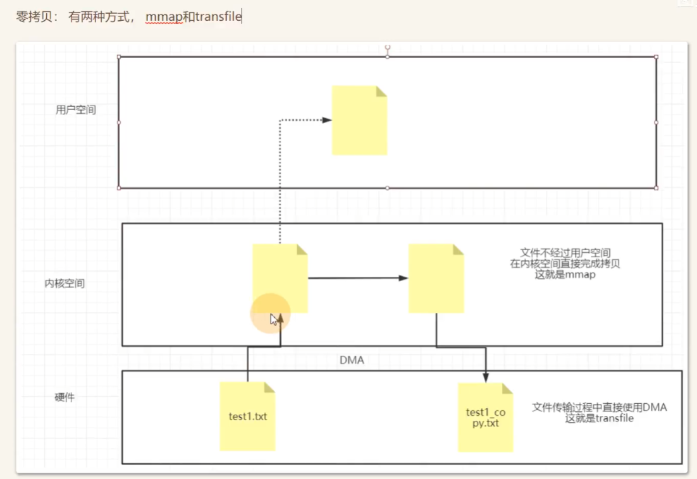

# 面试题总结

## 1.美团经典面试题(3.18暑期实习，leetcode)

1. 设计一个网络页面计数器, 要求准确记录某一个时间段内用户到访的次数?

```c++
/**
    1.第一种，单页面统计。就是说，只要点击这个页面就会统计一次。 
    2.利用jsp的内置对象application进行统计。这个程序结果运行分析，也是访问一次页面统计一次。 
    3.利用jsp的application和sess器关闭才失效ion进行统计。它的原理是，访问者打开浏览器到关闭浏览器算一次访问。每次打开首页，创建一个session，这个session直到浏览。
*/
```

2. 假设用户刷新了一次页面就算一次访问记录, 那这应该怎么设计?

```c++
    // Page View

    /*
    用户每次刷新即被计算一次；是目前判断网站访问流量最常用的计算方式之一，也是反映一个页面受欢迎程度的重要指标之一。
    */
```
3. 服务器端的性能瓶颈问题, 你会怎么设计&改进?
4. 分布式计数器怎么实现?
5. 不同版本之间的更新问题?
6. MVCC和数据库的锁的设计, 为什么要设计成row-lock+next-key-lock的形式?
7. 如果让你重新修改, 你会怎么修改? 怎样改进并发写的性能?
8. TCP连接有什么计数器?(实际上是重传,TIME_WAIT,PERSISTENT,KEEP-ALIVE)
9. 分布式数据库一致性怎么保持?(MySQL的binlog, 主从复制, 怎么做负载均衡?)

算法题

写一个最短路算法 (BFS, Bellman-Ford, Floyd-Warshall, Dijkstra)

```c++

```

## 2.
1. 利用标准库容器封装 char*，实现自动增长的缓冲区；这个自动增长是怎么实现的

2. 既然是ET模式，就有必要一次性把Tcp读缓冲区的数据一次性读完，否则下次Epoll时间将不再触发"，而面试官说其实Tcp是流式协议，所以请求不一定一次能读完
3. 智能指针的线程安全问题
4. 快速排序和堆排序的区别
```C++
// 快速排序思想 就是以一个flag进行标号 将出现很多的优化方法
void quick_sort(vector<int> nums, int left, int right){
    // int mid = left+right >>1;
    int i= left, j = right
    while(i < j){
        while(i < j&& nums[j] >= nums[left])j--;
        while(i < j&& nums[i] <= nums[left])i++;
        if(i < j)swap(nums[i]], nums[j]);
    }
    swap(nums[i], nums[left]);
    quick_sort(nums, left, i-1);
    quick_sort(nums, i + 1, right);
}

// 堆排序思想

//大顶堆对于数组的定义 arr[i] >= arr[2i+1] && arr[i] >= arr[2i+2]
//小顶堆对于数组的定义 arr[i] <= arr[2i+1] && arr[i] <= arr[2i+2]
void maxheap(vector<int>&nums, int arrsize, int i) {
	while (i < arrsize) {
		int left = 2 * i + 1, right = 2 * i + 2;
		int tempmaxIndex = i;
		if (left< arrsize && nums[left] > nums[tempmaxIndex]) tempmaxIndex = left;
		if (right< arrsize && nums[right] > nums[tempmaxIndex]) tempmaxIndex = right;

		if (tempmaxIndex == i) {
			break;
		}
		swap(nums[i], nums[tempmaxIndex]);
		i = tempmaxIndex;
	}
}

void heap_sort(vector<int>&nums) {
	int n = nums.size();
	// 第一次堆调整，将其变为大顶堆
	for (int i = n / 2 - 1; i >= 0; i--) {
		maxheap(nums, n, i);
	}

	// 排序处理
	swap(nums[0], nums[n - 1]);
	for (int i = n - 2; i >0; i--) {
		n--;
		maxheap(nums, n, 0);
		swap(nums[0], nums[i]);
	}
}
```
5. Epoll和线程池的区别
6. 如何判断一个函数是否存在内存泄漏
```c++
/*
    1. 在linux上使用命令查看 ps-aux (用来查看进程的VSZ值)
    2. 静态处理
        a. 手动检测 查看堆栈，变量内存地址，局部作用域返回后是否内存地址区释放
        b. 代码静态扫描和分析的工具比较多，比如 splint, PC-LINT, BEAM 等。
            BEAM可以检测四类问题: 
                没有初始化的变量;
                废弃的空指针;
                内存泄漏;
                冗余计算
        c. 重载 new delete
        可以重载内存分配和释放函数 new 和 delete,然后编写程序定期统计内存的分配和释放，从中找出可能的内存泄漏。或者调用系统函数定期监视程序堆的大小，关键要确定堆的增长是泄漏而不是合理的内存使用。
    3. 运行时检测
        实时检测工具主要有 valgrind, Rational purify 等
*/
```
7. reactor 和 proactor模型

## 个人对面试补充知识点

1 进程并发

2 进程如何做到隔离()

3 reactor & proactor

4.LRU & LFU

    LRU(最近最少使用算法),其核心设计数据结构是使用一个hashmap,和一个double linked list合并实现,越靠近头部表示越近使用，越靠近尾部表示越晚使用，最先删除
    * 存在的实现要点
        * 构建一个带有伪头和伪尾结点的doubleLinkedList
        * 对双链表实现插入和删除两个基本操作
        * 初始化LRU，至少包含其capacity，和初始化两个头尾结点，使其相互半指向，以便于访问
        * 实现LRU方法：get()，没有结点时候返回-1，存在该节点，删除、插入一次，使其靠近*head;表明最近使用
        * 实现LRU方法：put()，当结点存在时候，将其位置移到最近使用时，当结点不存在时 分为是否大于容量不大于容量的插入,当大于容量时，将靠近尾结点值进行删除，而后添加，否则，直接添加到头部，注意删除过程要对指针delete.


```c++
struct LinkedList{
    int key, val;
    LinkedList* prev;
    LinkedList* next;
    LinkedList():key(0), val(0),prev(nullptr),next(nullptr){};
    LinkedList(int _key, int _val):key(_key),val(_val),prev(nullptr),next(nullptr){};
}*head, *tail; //构建伪头部和伪尾部结点，不用于存储值

void insert(LinkedList* node){ // 采用头插法处理
    node->next = head->next;
    head->next->prev = node;

    head->next = node;
    node->prev = head;
}

void remove(LinkedList* node){
    node->prev->next = node->next;
    node->next->prev = node->prev;
}

class LRUCache{
public:
    LRUCache(int capacity){
        n = capacity;
        head = new LinkedList(-1,-1);
        tail = new LinkedList(-1,-1);
        head->next = tail, tail->prev = head; //将两个伪结点相链接
    }

    int get(int key){
        if(hashmap.count(key) == 0){
            return -1;
        }
        LinkedList* res = hashmap[key];
        remove(res);
        insert(res);
        return res->val;
    }

    void put(int key, int val){
        if(hashmap.count(key) > 0){
            LinkedList* node = hashmap[key];
            node->val = val;
            remove(node);
            insert(node);
        }else{
            if(hashmap.size() == n){
                LinkedList* node = tail->prev;
                remove(node);
                hashmap.erase(node->key);
                delete node;
            }
            LinkedList* newNode = new LinkedList(key, val);
            hashmap[key] = newNode;
            insert(newNode);
        }
    }

private:
    int n;
    unordered_map<int, LinkedList*> hashmap;
};

```
    LFU实现过程较LRU更加复杂，更难以把握，其基本设计过程为


```c++
// design for LFU
struct LinkedNode {
	int key; int val; int freq;
	LinkedNode* prev;
	LinkedNode* next;
	LinkedNode() :key(0), val(0), freq(0), prev(nullptr), next(nullptr) {};
	LinkedNode(int _key, int _val) :key(_key), val(_val), freq(1), prev(nullptr), next(nullptr) {};
};

struct LinkedNodeList {
	LinkedNode* head;
	LinkedNode* tail;
	LinkedNodeList() {
		head = new LinkedNode(-1, -1);
		tail = new LinkedNode(-1, -1);
		head->next = tail;
		tail->prev = head;
	}
};

class LFUCache {
public:
	LFUCache(int capacity) {
		n = capacity;
		curr_capacity = 0;
		minfreq = 0;
	}

	int get(int key) {
		if (key_table.count(key) == 0) {
			return -1;
		}
		LinkedNode* node = key_table[key];
        int res = node->val;
		removeNode(node);
		node->freq += 1;
		InsertNode(node);
		return res;
	}

	void put(int key, int val) {
		if (n == 0) return;
		if (key_table.count(key)) {
			LinkedNode* node = key_table[key];
			node->val = val;
			node->freq += 1;
			removeNode(node);
			InsertNode(node);
		}
		else {
			if (curr_capacity == n) { // 当前已经满载
				LinkedNode* node = freq_table[minfreq].tail->prev;
				node->prev->next = freq_table[minfreq].tail;
				freq_table[minfreq].tail->prev = node->prev;
				key_table.erase(node->key);
				delete node;
				curr_capacity -= 1;
			}

			LinkedNode* newNode = new LinkedNode(key, val);
			minfreq = 1;
			key_table[key] = newNode;
			InsertNode(newNode);
			curr_capacity -= 1;
		}
	}
private:
	int n;
	int curr_capacity;
	int minfreq;
	unordered_map<int, LinkedNodeList> freq_table;
	unordered_map<int, LinkedNode*> key_table;

	void removeNode(LinkedNode* node) {
		node->prev->next = node->next;
		node->next->prev = node->prev;

		if (node->freq == minfreq && freq_table[minfreq].head->next == freq_table[minfreq].tail) {
			minfreq += 1;
		}
	}

	void InsertNode(LinkedNode* node) {
		node->prev = freq_table[node->freq].head;
		freq_table[node->freq].head->next = node;

		node->next = freq_table[node->freq].head->next;
		freq_table[node->freq].head->next->prev = node;
	}
};

```

2.1追问：设置相应头方式可能会有啥问题，什么隐患考虑过吗？

回答了可能会跳转到其他恶意页面


3.对于安全风险这方面有一些了解吗？

回答🈚️


4.分布式系统具体体现在哪里，为什么要这么设计呢，会有什么问题，如何去避免呢？

回答六个微服务对应六个功能模块，去耦合，一个微服务挂了不至于雪崩，服务熔断讲解，服务降级讲解

4.1追问：不做服务熔断/ 降级，有什么风险

回答雪崩， A服务等待B服务，陷入阻塞，资源耗尽

4.2追问：有哪些中间件帮我们做这些动作？

回答 gateway，nginx

4.3追问：有去看过他里面的一些原理吗？怎么去实现的？怎么去判断窗口期，怎么去聚合，可能会有哪些维度的问题要考虑？

回答 🈚️

4.4追问：事务的一致性保障和微服务之间的关系，如何选择判断？

回答对事务的理解，其他 🈚️

4.5追问：服务之间可能有矛盾，下单微服务和减库存微服务有可能不一致，如何保证他们原子性操作？

回答：加锁，当成线程去考虑，不知道微服务中怎么操作


5.数据库中有哪些设计导致他有这样一个事务性吗？

回答innodb 存储引擎支持事务操作，不知道具体实现原理

5.1追问：数据库中线程啊，日志文件，数据文件有去了解过吗？

回答了 mvcc中的undo-log以及mvcc 解释

5.2追问：加锁的具体方式？

gap， record，get-NextKey锁各自讲解

5.3追问：具体从代码层面，从sql 层面怎么去写来让他有这样一个锁的一个状态？

🈚️


6.线程这一块知道哪些方式去启动一个异步线程吗？

Tread，Runnable 接口，线程池

6.1追问：处理这个线程之后去获取它的结果的话，有哪些可选的Java 实现让我们去使用？

回答强扯 CountDownLatch主线程等待各工作线程再去执行主线程

6.2追问：runnable 接口实现的线程本身不带返回值，使用哪些类可以拿到这些线程的执行结果

回答 🈚️


7.索引结构

myisam+innodb各自讲解

7.1追问：聚簇索引对遍历性能提升在哪方面？时间？空间？用时间复杂度，空间复杂度公式来表示的话是怎样一个变化？

回答 n->logn（瞎扯）空间🈚️


8.jvm类加载这块，跟过代码看过Spring启动过程吗？Java类函数的启动过程？

回答类对象加载创建的过程

8.1追问Java 中加载顺序为什么是这样的，是来解决我们什么问题的，是来解决Java哪些维度的痛点？如何去加载容器里面的bean 和自己的bean？

回答被依赖的先被加载（瞎扯）

8.2如何做到的先加载容器的，再加载自己的jar 包？即如何识别出哪些是容器的，哪些是应用的？类加载机制的哪些特点导致了他这个特性？

回答 🈚️，提示就近机制，委派机制


9.哪一块是你学习学的深度广度好的？

回答hashmap

9.1追问就是常用的框架有了解吗？

回答简单使用

9.2微服务和消息的框架用过吗？

回答 springcloudAlibaba的三个组件，消息🈚️


10.你做的上线的项目，有没有做过应急处理还有排查的工作吗？

10.1介绍项目，瞎扯危机

追问：解决问题的方式

回答查论文

10.2解决危机有尝试其他方法吗？一般遇到问题常规的怎么去解决？

回答 csdn，stackoverflow，查论文


## bfs与dfs

### 前序遍历
```c++
// 先序遍历
/* 递归操作 根左右遍历方式 */
vector<int> ans;
void dfs(TreeNode* root){
	if(!root) return;
	ans.emplace_back(root->val);
	dfs(root->left);
	dfs(root->right);
}


/* 迭代操作  使用一个辅助栈 当前栈依赖于先压栈*/
vector<int> preorder(TreeNode * root){
	vector<int> preorderTraversal(TreeNode* root) {
        vector<int>ans;
        if(!root) return ans;
        stack<TreeNode*>stk;
        TreeNode* node = root;
        stk.push(node); 	// 根
        while(!stk.empty()){
            node = stk.top(); // 根节点
            ans.emplace_back(node->val);
            stk.pop();
            if(node->right) stk.push(node->right); // 右子
            if(node->left) stk.push(node->left);   // 左子
        }
        return ans;
    }
}

```

### 中序遍历
```c++
/* 中序遍历 dfs 讲究的左 中 右 */
vector<int> ans;
void dfs(TreeNode* root){
	if(!root) return;
	dfs(root->left);
	ans.emplace_back(root->val);
	dfs(root->right);
}

vector<int> inordered(TreeNode* root){
	vector<int> ans;
	stack<TreeNode*> stk;
	TreeNode* node = root;
	while(node|| !stk.empty()){
		while(node){
			stk.push(node);
			node = node -> left;			// 左
		}
		node = stk.top();
		stk.pop();
		ans.emplace_back(node->val);		// 中
		node = node->right;					// 右
	}
	return ans;
}

```

### 后续遍历
```c++
/* 递归写法 遵从 先左右 然后跟节点的操作模式 */
vector<int> ans;
void dfs(TreeNode* root){
	if(!root) return;
	dfs(root->left);
	dfs(root->right);
	ans.emplace_back(root->val);
}

/* 迭代写法 */
vector<int> postordered(TreeNode * root){
	vector<int>ans;
	if(!root) return ans;
	stack<TreeNode*>stk;
	TreeNode* node = root;
	stk.push(node);
	while(!stk.empty()){
		node = stk.top();
		stk.pop();
		ans.emplace_back(node->val);
		if(node->right) stk.push(node->right);
		if(node->left) stk.push(node->left);
	} 
	reverse(ans.begin(), ans.end());
	return ans;
}
```


# 中间件相关
## 消息队列有哪些作用
1. 解耦：使用消息队列来作为两个系统直接的通讯方式，两个系统不需要相互依赖

2. 异步：当系统给消费队列发送完毕消息后，就可以处理其他业务

3. 流量削峰：如果使用消息队列方式来调用某一系统，消息可以在队列中排队，由消费者控制消息消费速度

## 死信队列 & 延时队列
1. 死信队列是一种消息队列，用来存放没有成功消费的消息，通常可以用来作为消息重试

2. 延时队列就是用来存放需要在指定时间被处理的元素的队列，通常可以用来处理一些具有过期性操作的业务，比如十分钟内为支付则取消订单

## 消息中间件是如何保证消息的高速读写的
零拷贝：kafka和RocketMQ都是通过零拷贝技术来优化文件读写的

零拷贝相关要点


 1. java当中对零拷贝进行了封装，mmap方式通过MappedByteBuffer对象进行操作，而transfile通过FileChannel来进行操作。

 2. mmap适合比较小的文件,通常文件大小不要超过1.5G~2G之间; transfile没有文件大小限制

 3. RocketMQ当中使用mmap方式来对他的文件进行读写.commitlog. 1G

 4. 在kafka当中，他的index日志文件也是通过mmap的方式来读写的,在其他日志文件中，并没有实现零拷贝的方式  --> kafka 使用transfile方式将硬盘数据加载到网卡

## 消息队列的发送和接受如何保证顺序

(全局有序和局部有序) MQ只需要保证局部有序，不需要保证全局有序

1. RocketMQ provide ordered messages using FIFO order. (MessageQueueSelector)

2. 在消息队列中，由于生产者的并发，导致其消息队列并非一个消息队列，二十多个


## RocketMQ支持事务消息原理
依赖于TransactionListener接口

* executeLocalTransaction方法会在放松消息后调用，用于执行本地事务，如果本地事务执行成功，RocketMQ再提交消息。

* checkLocalTransaction用于对本地事务进行检查，RocketMQ依赖此方法进行补偿

通过两个内部的topic来实现的对消息的两阶段支持

prepare:将消息(消息上带有事务标识)投递到一个名为RMS_SYS_TRANS_HALF_TOPIC的topic中，而不是投递到真正的topic中

commit/rollback:producer再通过TransactionListener的executeLocalTransaction方法执行本地事务，当producer的localTransaction处理成功或者失败后，producer会向broker发送commit或者rollback命令，如果是commit，则broker会将投递到RMS_SYS_TRANS_HALF_TOPIC中的消息投递到真实的topic中，然后再投递一个表示删除的消息到RMS_SYS_TRANS_HALF_TOPIC中，表示当前事务已经完成；如果是rollback,则没有投递到真实的topic的过程，只需要投递表示删除的消息到RMS_SYS_TRANS_HALF_TOPIC。最后，消费者像消费普通消息一样消费该消息。
